# 🇬🇪 Georgian RAG System v1.0

**Production-Grade Multilingual Retrieval-Augmented Generation System**

[](https://opensource.org/licenses/MIT)
[](https://www.python.org/downloads/)
[](https://www.docker.com/)
[](https://hub.docker.com/r/nastassiatim/georgian-rag)
[](#supported-languages)
[](https://qdrant.tech/)
[](https://www.anthropic.com/)

> **An enterprise-ready RAG system providing intelligent tourism information about Georgia in 18 languages.** 
>
> Features: Hybrid Search • Adaptive Filtering • Smart Caching • Conversation Management • Translation Pipeline • Monitoring Stack
---

## 📋 Table of Contents

- [Overview](#overview)
- [Key Innovations](#key-innovations)
- [System Architecture](#system-architecture)
- [Core Components](#core-components)
- [Search Pipeline Workflow](#search-pipeline-workflow)
- [Performance & Caching](#performance--caching)
- [Monitoring & Observability](#monitoring--observability)
- [Quick Start](#quick-start)
- [Usage Examples](#usage-examples)
- [API Documentation](#api-documentation)
- [Docker Hub](#docker-hub)
- [Configuration](#configuration)
- [Development](#development)
- [Future v2](#future-v2-agentic-system)
- [Technical Stack](#technical-stack)
- [Author](#author)

---

## Overview

**Georgian RAG System** - months of dedicated development to create a production-grade, multilingual RAG system for Georgian tourism.

### Database
- 📍 **1,715** сarefully selected Georgian landmarks in a custom dataset
- 🗂️ **6 categories**: religious sites, fortresses, nature, museums, historical sites, attractions  
- 🌍 **Multilingual metadata**: Georgian, Russian, English
- 🖼️ **High-quality images** on Cloudinary CDN
- 📊 **Rich structured data**: locations, categories, historical context

### Performance
- ⚡ **3-5 seconds** (cached queries)
- ⚡ **10-15 seconds** (new queries)  
- 📈 **~90% cache hit rate**
- 🎯 **85%+ relevance** for top results
- 🔄 **99.9% uptime** with auto-recovery

### Languages Supported (18)
🇬🇧 English • 🇷🇺 Russian • 🇬🇪 Georgian • 🇩🇪 German • 🇫🇷 French • 🇪🇸 Spanish • 🇮🇹 Italian • 🇵🇹 Portuguese • 🇳🇱 Dutch • 🇵🇱 Polish • 🇹🇷 Turkish • 🇨🇳 Chinese • 🇯🇵 Japanese • 🇰🇷 Korean • 🇸🇦 Arabic • 🇮🇳 Hindi • 🇮🇱 Hebrew • 🇸🇪 Swedish

---

## ✨ Key Innovations

### 🔍 1. Advanced Multi-Stage Search Pipeline

**3-stage architecture** (not simple vector search):

**Stage 1: Pre-Filtering (200-300 candidates)**
- Adaptive strategies: strict/moderate/loose
- Case-insensitive attraction name matching
- Boolean metadata filters (AND logic)
- Text filters (OR logic)
- Automatic fallback on insufficient results

**Stage 2: Hybrid Search (Top 10-20)**
- **Dense Semantic Search**: Multilingual embeddings (384-dim)
- **BM25 Lexical Search**: Keyword-based with Georgian/Russian stemming
- **Parallel execution**: Both run simultaneously

**Stage 3: Re-Ranking (Top K final)**
- **Reciprocal Rank Fusion (RRF)**: Combines scores
- **Weighted fusion**: 0.6 dense + 0.4 BM25
- **Duplicate removal**: Ensures unique results

### 🧠 2. Intelligent Query Analysis

**Query understanding engine** that:
- Detects language (18 languages via langdetect)
- Extracts attraction names and categories
- Identifies metadata constraints
- Generates enhanced semantic queries
- Selects optimal filtering strategy

**Example:**
```
Input: "wunderschöne Kirchen in der Nähe von Tiflis"
↓
Analysis:
- Language: German (0.99 confidence)
- Translation: "beautiful churches near Tbilisi"
- Filters: category=religious_site, location=Tbilisi region
- Strategy: MODERATE (allows nearby locations)
- Enhanced: "beautiful churches Tbilisi Georgian Orthodox architecture..."
```

### 💾 3. Multi-Layer Smart Caching (5 Layers)

**Layer 1: Query Results Cache**
- Full responses cached (1-hour TTL)
- Key: query + language + top_k
- ~60% hit rate

**Layer 2: Dense Search Cache**  
- Vector search results (LRU, 500 entries)
- Key: semantic_query + filters (excludes candidate_ids)
- ~85% hit rate
- **Clever**: Reusable across similar queries

**Layer 3: Pre-Filter Candidates Cache**
- Document IDs (200-300 per query)
- Survives across different top_k values
- ~90% hit rate

**Layer 4: Embedding Model Cache**
- SentenceTransformer model in memory (~500MB)
- Lazy loading, process lifetime
- 100% hit rate after first load

**Layer 5: BM25 Index Cache**
- Pre-built indices for all languages
- Loaded at startup
- 100% hit rate

**Result**: 87% of operations served from cache!

### 🗣️ 4. Conversation Management

**Session-aware responses:**
- Tracks conversation history (last 5 turns)
- Context injection for follow-ups
- Handles "tell me more", "what else"
- Session timeout: 1 hour

**Example:**
```
Turn 1: "Tell me about Tbilisi"
→ [Response about Tbilisi]

Turn 2: "What about churches there?"
→ System remembers "there" = Tbilisi
→ Searches specifically for Tbilisi churches
```

### 🌐 5. Advanced Translation Pipeline

**Smart translation with minimal overhead:**

**1. Query Translation (Input only):**
- Non-English query → Google Cloud Translation OR Groq → English
- English query → No translation needed
- Purpose: Standardize for search (embeddings work better in English)

**2. LLM Instruction (No translation):**
- System prompt tells Claude: "Respond in {target_language}"
- Claude generates response directly in target language
- No post-generation translation needed! 
**Fallback Chain (for Query Translation only):**

- Primary: Google Cloud Translation API
- Fallback: Groq with translation prompt
- Last resort: Use original query (if English-ish)
- **Proper noun preservation**: Attraction names unchanged

####  Translation Pipeline


### 📋 6. Dynamic Disclaimer System

**18-language disclaimer management:**
- Automatic injection based on query type
- Language-specific translations
- Conditional triggers:
  - Hours mentions → "Hours may vary"
  - Prices → "Prices subject to change"
  - Travel advice → "Check official sources"
  - Weather → "Conditions unpredictable"
 
 #### Example of work
 
 
 
### 🔄 7. Model Manager with Lazy Loading

**Efficient resource management:**
- Models loaded only when needed
- Singleton pattern (one instance per process)
- Supports: embeddings, LLM (Claude/Groq), translation
- Memory optimization
- Health monitoring

### 🎯 8. Adaptive Filtering Strategy

**Intelligent pre-filtering:**

**Strict** (specific queries):
- All filters applied
- Example: "Svetitskhoveli Cathedral"

**Moderate** (category queries):
- Text filters + priority metadata
- Priority: is_religious_site, is_nature_tourism, language
- Example: "Churches in Kakheti"

**Loose** (broad queries):
- Text filters + critical metadata only
- Critical: is_religious_site, language
- Example: "Things to see in Georgia"

**Automatic fallback:**
```
Try Strict → <2 results → Try Moderate → <2 results → Try Loose → <2 results → No filters
```

---
## 🏗️ System Architecture

### Translation Pipeline

```mermaid
graph TD
    A[1. Input Query<br/>Any of 18 languages] --> B{Is English?}
    B -->|No| C[2. Query Translation<br/>Google Cloud OR Groq]
    B -->|Yes| D[3. Search in English]
    C --> D
    D --> E[Pre-filter → Dense → BM25 → RRF]
    E --> F[4. LLM Generation<br/>System: Respond in target_lang]
    F --> G[Claude generates DIRECTLY<br/>in target language]
    G --> H[5. Final Response<br/>Already in correct language!]
    
    style A fill:#e1f5ff
    style F fill:#fff4e6
    style H fill:#e8f5e9
```

---
### System Architecture

---
### Storage & Monitoring

---
## 🔧 Core Components

### 1. Query Analyzer (`search/query_analyzer.py`)

**Understands user intent and extracts search parameters**

**Key Features:**
- Language detection (18 languages)
- Query translation for analysis
- Attraction name extraction
- Category identification
- Metadata filter generation
- Strategy selection (strict/moderate/loose)
- Semantic query enhancement

**Intelligence Example:**
```python
Input: "Какие самые красивые церкви в Грузии?"

Output: QueryAnalysis(
    original_query="Какие самые красивые церкви в Грузии?",
    semantic_query="beautiful churches Georgia Orthodox architecture...",
    detected_language="ru",
    qdrant_filters=[
        FieldCondition(key="is_religious_site", match=True),
        FieldCondition(key="category", match=MatchAny(["храм", "собор"]))
    ],
    filter_strategy="moderate",
    intent="informational"
)
```

### 2. Pre-Filter Engine (`search/PreFilterEngine.py`)

**Narrows 1715 documents to 200-300 candidates**

**Key Features:**
- Adaptive filtering (3 strategies)
- Case-insensitive name matching
- Boolean filters (AND logic)
- Text filters (OR logic)
- Automatic fallback
- Results caching (~90% hit rate)

**Filtering Logic:**
```python
# Text filters: OR (any attraction name matches)
text_filters = [
    FieldCondition(key="name", match=MatchAny([
        "svetitskhoveli", 
        "Svetitskhoveli", 
        "SVETITSKHOVELI"
    ]))
]

# Boolean filters: AND (all must match)
boolean_filters = [
    FieldCondition(key="is_religious_site", match=True),
    FieldCondition(key="language", match="ru")
]

# Combined
Filter(should=text_filters, must=boolean_filters)
```

### 3. Dense Search Engine (`search/dense.py`)

**Semantic vector search with smart caching**

**Key Features:**
- Model: paraphrase-multilingual-MiniLM-L12-v2 (384-dim)
- Supports 50+ languages including Georgian
- Smart caching (excludes candidate_ids from key!)
- LRU eviction (500 entries)
- Lazy model loading
- ID filtering support

**Cache Strategy:**
```python
# Cache key WITHOUT candidate_ids (reusable)
cache_key = hash(semantic_query + str(top_k))

if cache_key in cache:
    cached_results = cache[cache_key]
    
    # Filter by candidate_ids if provided
    if candidate_ids:
        return filter_by_ids(cached_results, candidate_ids)
    
    return cached_results

# Result: ~85% cache hit rate
```

### 4. BM25 Search Engine (`search/bm25.py`)

**Keyword-based lexical search**

**Key Features:**
- Language-specific stemming (Georgian, Russian, English)
- Stopword removal
- TF-IDF scoring
- Pre-built indices (loaded at startup)
- Separate index per language

**Language Processing:**
```python
# Georgian
georgian_stopwords = {'და', 'არის', 'კი', 'რომ', ...}
tokens = [t for t in tokenize(text) if t not in georgian_stopwords]

# Russian
from nltk.stem.snowball import RussianStemmer
stemmer = RussianStemmer()
tokens = [stemmer.stem(t) for t in tokenize(text)]
```

### 5. Hybrid Search Engine (`search/HybridSearchEngine.py`)

**Orchestrates entire search pipeline**

**Key Features:**
- Parallel dense + BM25 execution
- Reciprocal Rank Fusion (RRF)
- Score normalization
- Configurable weights (0.6 dense + 0.4 BM25)
- Duplicate removal

**RRF Formula:**
```python
RRF_score(doc) = sum(weight / (k + rank_i))

where:
- k = 60 (standard constant)
- rank_i = position in each result list
- weight = 0.6 (dense) or 0.4 (BM25)
```

### 6. Context Assembler (`rag/context_assembler.py`)

**Builds rich context for LLM**

**Key Features:**
- Formats search results with metadata
- Includes conversation history (last 3-5 turns)
- Structures context in Markdown
- Adds query metadata
- Optimizes for token efficiency

**Context Structure:**
```markdown
# Relevant Georgian Attractions

## 1. Tsminda Sameba
**Location**: Tbilisi
**Category**: Cathedral
**Score**: 0.89
**Description**: [Full description...]
**Image**: [URL]

---

## 2. Jvari Monastery
[...]

# Previous Conversation
User: [Previous query]
Assistant: [Previous response]

# Query Metadata
- Total sources: 5
- Search method: Hybrid
- Language: English
```

### 7. LLM Manager (`llm/llm_manager.py`)

**Handles LLM calls with fallback**

**Key Features:**
- Multi-provider support (Claude, Groq)
- Automatic fallback on failures
- Retry logic
- Token tracking
- Response formatting

**Providers:**
1. **Primary**: Claude 3.5 Sonnet (200K context)
2. **Fallback**: Groq Mixtral 8x7B (32K context)

**System Prompt:**
```
You are a knowledgeable guide for Georgian tourism.

Response requirements:
- Format in Markdown with headers
- Use relevant emojis
- Enthusiastic but informative tone
- Include ONLY information from sources
- Structure: Intro + Details + Tips
- Language: {target_language}
- DO NOT invent information
```

### 8. Translation Manager (`multilingual/translation_manager.py`)

**Handles all translation needs**

**Key Features:**
- Multi-provider fallback chain
- Proper noun preservation
- Cultural context awareness
- Bidirectional translation
- Error resilience

**Translation Flow:**
```
1. Try Google Cloud Translation (primary)
2. If fails → Try Groq with translation prompt
3. If fails → Return original text

Special: Extract attraction names → Translate text → Restore names
```

### 9. Disclaimer Manager (`utils/disclaimer.py`)

**Injects safety disclaimers**


**Key Features:**
- 18-language support
- Conditional injection (based on query triggers)
- Multiple disclaimer types
- Template system

**Triggers:**
```python
if "hours" in query → Add hours disclaimer
if "price" in query → Add pricing disclaimer  
if "travel" in query → Add travel advisory
if "weather" in query → Add weather notice
```

### 10. Conversation Manager (`conversation/conversation_manager.py`)

**Maintains conversation state**

**Key Features:**
- Session management (1-hour timeout)
- History tracking (last 5 turns)
- Follow-up detection
- Context enhancement
- History pruning

**Follow-up Handling:**
```python
history = get_history(session_id)
last_query = history[-1]['query']

if "tell me more" in current_query:
    enhanced_query = f"{current_query} (about: {last_query})"
```

### 11. Model Manager (`utils/model_manager.py`)

**Manages embedding models**

**Key Features:**
- Lazy loading (only when needed)
- Singleton pattern (one instance)
- Memory optimization
- Health monitoring
- Multi-model support

---

## 🔄 Search Pipeline Workflow

### Example: Complete Query Flow

**Input Query:** `"Какие самые красивые церкви в Грузии?"` (Russian)

**Step-by-Step Processing:**

#### Step 1: Request Reception (0.01s)
```
POST /query
{
  "query": "Какие самые красивые церкви в Грузии?",
  "language": "ru",
  "top_k": 5
}

→ FastAPI validates input
→ Generates session_id
→ Logs to PostgreSQL: query_start
```

#### Step 2: Language Detection (0.01s)
```
Input: "Какие самые красивые церкви в Грузии?"
→ langdetect.detect() → 'ru' (confidence: 0.99)
→ Sets target_language = 'ru'
```

#### Step 3: Query Translation (0.02s)
```
Russian: "Какие самые красивые церкви в Грузии?"
→ Google Cloud OR Groq
→ English: "What are the most beautiful churches in Georgia?"
```

#### Step 4: Query Analysis (0.03s)
```
English query analyzed:

Extracted:
- Intent: INFORMATIONAL
- Category: religious_site
- Filters: ["church", "cathedral", "monastery"]
- Location: Georgia (broad)
- Strategy: MODERATE

Enhanced semantic query:
"What are the most beautiful churches in Georgia? Georgian Orthodox 
churches historical religious architecture cathedral monastery Byzantine 
frescoes ancient Christianity Svetitskhoveli Sameba Gelati Jvari..."
```

#### Step 5: Cache Check (0.001s)
```
cache_key = hash("Какие самые..." + "ru" + "5")
→ Query cache MISS (first time)
→ Proceed to search
```

#### Step 6: Pre-Filtering (0.18s)
```
Strategy: MODERATE

Filters:
- must: [is_religious_site=true, language="ru"]
- should: []

Execute Qdrant search:
→ Query vector: [0.234, -0.123, ...]
→ With filters
→ Limit: 300

Result: 287 candidate IDs
Cache for future use
```

#### Step 7: Hybrid Search (0.07s parallel)

**Dense Search Thread:**
```
1. Check dense cache: MISS
2. Generate embedding (45ms)
3. Qdrant vector search on 287 candidates
4. Results: [
     ("539", 0.89),
     ("540", 0.87),
     ("597", 0.85),
     ...
   ] (10 results)
5. Cache results
```

**BM25 Search Thread:**
```
1. Tokenize Russian query: ["красив", "церков", "груз"]
2. BM25 scoring with russian_index
3. Filter by 287 candidate IDs
4. Results: [
     ("539", 8.7),
     ("597", 8.3),
     ("540", 7.9),
     ...
   ] (10 results)
```

#### Step 8: Re-Ranking (0.003s)
```
Reciprocal Rank Fusion:

doc_539: 0.6/(60+1) + 0.4/(60+1) = 0.01640  ← TOP 1
doc_540: 0.6/(60+2) + 0.4/(60+3) = 0.01603
doc_597: 0.6/(60+3) + 0.4/(60+2) = 0.01597
doc_593: 0.6/(60+4) + 0.4/(60+5) = 0.01550
doc_1087: 0.6/(60+5) + 0.4/(60+7) = 0.01522  ← TOP 5

Final ranking: [539, 540, 597, 593, 1087]
```

#### Step 9: Context Assembly (0.015s)
```
Build context for LLM:

# Relevant Georgian Attractions

## 1. Цминда Самеба
Location: Тбилиси
Category: Православный собор
Score: 0.89
Description: [Full Russian description...]
Image: https://...539.jpg

## 2-5. [Other churches...]

# Query Metadata
- Total: 5 sources
- Method: Hybrid (Dense + BM25 + RRF)
- Language: Russian

Context length: ~3,200 tokens
```

#### Step 10: LLM Generation (8.4s)
```
API: Claude 3.5 Sonnet

System Prompt: [Guide instructions, Russian output]
User Message: [Full context + query]

Response Generated:
"# ⛪ Прекрасные Церкви Грузии: Священные Сокровища!

Грузинские церкви — это архитектурные шедевры...

## 🏛️ **Цминда Самеба (Собор Святой Троицы)**

Этот великолепный собор — жемчужина Грузии!..."

Tokens: input=3247, output=892
```

#### Step 11: Translation (0s)
```
Target language = 'ru'
LLM already generated in Russian
→ SKIP translation
```

#### Step 12: Disclaimer Injection (0.002s)
```
Triggers found: "посетите", "часы"

Add Russian disclaimers:
"⚠️ Важная Информация:
🕒 Часы работы могут меняться...
🧭 Проверяйте официальные источники..."
```

#### Step 13: Response Packaging (0.005s)
```json
{
  "response": "[Full formatted response with disclaimers]",
  "language": "ru",
  "sources": [
    {
      "id": "539",
      "name": "Цминда Самеба",
      "location": "Тбилиси",
      "score": 0.89,
      "category": "Православный собор",
      "image_url": "https://...539.jpg",
      "description": "[Description...]"
    },
    ... (5 sources total)
  ],
  "metadata": {
    "duration": 12.47,
    "num_sources": 5,
    "detected_language": "ru",
    "cache_hit": false,
    "prefilter_candidates": 287,
    "search_strategy": "moderate",
    "model_used": "claude-sonnet-4-20250514",
    "total_tokens": 4139
  }
}
```

#### Step 14: Caching (0.005s)
```
Save to query_results_cache:
- Key: hash(query + lang + top_k)
- Value: Complete response
- TTL: 1 hour

Next identical query → 50ms response!
```

#### Step 15: Logging & Metrics
```
PostgreSQL:
INSERT INTO query_logs (...) VALUES (...)

Prometheus:
- http_request_duration_seconds: 12.47
- query_total{lang="ru", cache="false"}++
- llm_tokens_total{model="claude"} += 4139
- search_operations_total{type="hybrid"}++
```

#### Step 16: HTTP Response
```
HTTP/1.1 200 OK
Content-Type: application/json
X-Process-Time: 12.47s
X-Cache-Hit: false

{response JSON}
```

---

**Total Time: 12.47 seconds**

**Next identical query: 0.05 seconds** 

---

## ⚡ Performance & Caching

### Cache Layer Details

**Layer 1: Query Results**
- Location: API level
- Key: query + language + top_k
- TTL: 1 hour
- Hit rate: ~60%
- Benefit: Instant responses for exact repeats

**Layer 2: Dense Search**
- Location: Dense search engine
- Key: semantic_query + top_k + metadata_filter (NO candidate_ids)
- TTL: 1 hour, LRU eviction
- Size: 500 entries
- Hit rate: ~85%
- Benefit: Reusable across similar queries

**Layer 3: Pre-Filter Candidates**
- Location: Pre-filter engine
- Key: query_analysis + strategy + filters
- TTL: Unlimited
- Hit rate: ~90%
- Benefit: Skip entire pre-filtering stage

**Layer 4: Embedding Model**
- Location: Model manager
- Key: model_name
- TTL: Process lifetime
- Hit rate: 100% (after first load)
- Size: ~500MB in memory

**Layer 5: BM25 Indices**
- Location: BM25 search engine
- Key: language
- TTL: Process lifetime
- Hit rate: 100% (loaded at startup)
- Count: 3 indices (ka, ru, en)

### Response Time Breakdown

**Uncached Request:**
```
Request Processing:      0.02s  (0.2%)
Language Detection:      0.01s  (0.1%)
Query Analysis:          0.03s  (0.2%)
Pre-filtering:           0.18s  (1.4%)
Dense Search:            0.07s  (0.6%)
BM25 Search:             0.01s  (0.1%)
Re-ranking:              0.003s (0.02%)
Context Assembly:        0.02s  (0.2%)
LLM Generation:          8.40s  (67.2%) ← Bottleneck
Translation:             0.00s  (0%)
Disclaimer:              0.002s (0.02%)
Response Packaging:      0.01s  (0.1%)
Caching & Logging:       0.05s  (0.4%)
Network Overhead:        3.70s  (29.6%)
────────────────────────────────────
TOTAL:                   12.50s (100%)
```

**Cached Request:**
```
Request Processing:      0.02s  (40%)
Cache Lookup:            0.01s  (20%)
Response Return:         0.02s  (40%)
────────────────────────────────────
TOTAL:                   0.05s  (100%)

Speedup: 250x faster! 
```

### Cache Efficiency

**Overall Statistics:**
- 87% of operations served from cache
- ~2,847 seconds saved per hour
- Effective speedup: 6-8x on average

---

## 📊 Monitoring & Observability

### Monitoring Stack Components

**Prometheus (Port 9090)**
- Metrics scraping (15s intervals)
- 15-day retention
- Alert rule evaluation
- PromQL query interface

**Grafana (Port 3000)**
- Real-time dashboards
- Auto-refresh: 10s
- Login: admin/admin
- 10+ pre-built panels

**Alertmanager (Port 9093)**
- Alert routing
- Deduplication
- Grouping
- Telegram integration

**PostgreSQL (Port 5432)**
- Query logging
- Analytics
- User tracking
- Performance history

### Grafana Dashboard Panels

**Query Performance:**
- Response time (p50, p95, p99)
- Requests per minute
- Error rate %
- Success rate %

**Cache Statistics:**
- Hit rates by layer (pie chart)
- Cache size over time
- Evictions per hour
- Time saved (cumulative)

**Search Operations:**
- Dense search count
- BM25 search count
- Hybrid search count
- Strategy distribution
- Candidate count heatmap

**LLM Usage:**
- Total tokens consumed
- Cost estimation ($)
- Model distribution
- Average tokens/request

**Language Distribution:**
- Queries by language (pie)
- Translation requests
- Top languages today

**Recent Queries (Live Table):**
```
Query              | Lang | Time  | Sources | Cache
───────────────────────────────────────────────────
Best churches      | en   | 12.5s | 5       | false
Tbilisi sites      | en   | 0.05s | 5       | true
что посмотреть     | ru   | 11.2s | 3       | false
```

**System Health:**
- CPU usage %
- Memory usage MB
- Active connections
- Qdrant status indicator
- PostgreSQL status

### Prometheus Metrics

**Request Metrics:**
```
http_request_duration_seconds{endpoint="/query"} - Histogram
http_requests_total{method, status, endpoint} - Counter
```

**Cache Metrics:**
```
cache_hit_total{layer} - Counter
cache_miss_total{layer} - Counter
cache_size{layer} - Gauge
cache_evictions_total{layer} - Counter
```

**Search Metrics:**
```
search_operations_total{type, strategy} - Counter
prefilter_candidates_total - Histogram
dense_search_duration_seconds - Histogram
bm25_search_duration_seconds - Histogram
```

**LLM Metrics:**
```
llm_tokens_total{model, type} - Counter
llm_requests_total{model, status} - Counter
llm_duration_seconds{model} - Histogram
```

### Alert Rules

**Critical Alerts:**

**ServiceDown:**
```yaml
expr: up{job="georgian_rag_api"} == 0
for: 3m
severity: critical
→ Service has been down for 3+ minutes
```

**HighErrorRate:**
```yaml
expr: rate(http_requests_total{status=~"5.."}[5m]) > 0.05
for: 5m
severity: critical
→ Error rate above 5% for 5 minutes
```

**QdrantConnectionFailures:**
```yaml
expr: rate(qdrant_errors_total[5m]) > 0.1
for: 5m
severity: critical
→ Qdrant connection issues
```

**Warning Alerts:**

**SlowResponseTime:**
```yaml
expr: histogram_quantile(0.95, http_request_duration_seconds) > 30
for: 10m
severity: warning
→ p95 response time above 30s
```

**LowCacheHitRate:**
```yaml
expr: cache_hit_rate < 0.5
for: 15m
severity: warning
→ Cache hit rate below 50%
```

### Telegram Alerts

!()

**Message Format:**
```
🚨 CRITICAL: Service Down

georgian_rag_api health check failed
Duration: 3 minutes
Time: 2026-01-13 08:45:23 UTC

View Grafana:
http://localhost:3000/dashboard
```

**Recovery Messages:**
```
✅ RESOLVED: Service Down

georgian_rag_api is now healthy
Downtime: 5 minutes
Recovered: 2026-01-13 08:50:15 UTC
```

### PostgreSQL Query Logs

**Table: query_logs**
```sql
CREATE TABLE query_logs (
    id SERIAL PRIMARY KEY,
    query_id UUID,
    query_text TEXT,
    language VARCHAR(10),
    response_time FLOAT,
    num_sources INT,
    cache_hit BOOLEAN,
    search_strategy VARCHAR(20),
    timestamp TIMESTAMP DEFAULT NOW()
);
```

**Useful Queries:**
```sql
-- Average response time by language
SELECT language, AVG(response_time) 
FROM query_logs 
GROUP BY language;

-- Most popular queries
SELECT query_text, COUNT(*) 
FROM query_logs 
GROUP BY query_text 
ORDER BY COUNT(*) DESC 
LIMIT 10;

-- Cache hit rate trends
SELECT DATE(timestamp), 
       SUM(CASE WHEN cache_hit THEN 1 ELSE 0 END)::FLOAT / COUNT(*) 
FROM query_logs 
GROUP BY DATE(timestamp);
```

---

## 🚀 Quick Start

### Prerequisites

- Docker & Docker Compose
- 4GB+ RAM recommended
- API keys (Anthropic, Qdrant)

### Installation

```bash
# 1. Clone repository
git clone https://github.com/AnastasiaNLP/georgian-rag.git
cd georgian-rag

# 2. Copy environment template
cp .env.example .env

# 3. Edit .env with your API keys
nano .env

# Required:
# - ANTHROPIC_API_KEY
# - QDRANT_URL
# - QDRANT_API_KEY

# 4. Start all services
docker-compose up -d

# 5. Check health
curl http://localhost:8000/health
```

### First Query

```bash
curl -X POST http://localhost:8000/query \
  -H "Content-Type: application/json" \
  -d '{
    "query": "What are the best places in Tbilisi?",
    "language": "en",
    "top_k": 5
  }'
```

### Access Monitoring

- **API Docs**: http://localhost:8000/docs
- **Grafana**: http://localhost:3000 (admin/admin)
- **Prometheus**: http://localhost:9090

---

## 📖 Usage Examples

### English Query
```bash
curl -X POST http://localhost:8000/query \
  -H "Content-Type: application/json" \
  -d '{
    "query": "Best churches in Georgia",
    "language": "en",
    "top_k": 5
  }' | jq -r '.response'
```

**Response:**
```
⛪ Beautiful Churches in Georgia: Sacred Treasures Await!

## 🏛️ Tsminda Sameba (Holy Trinity Cathedral)
This magnificent cathedral is Georgia's crown jewel!...

[5 sources with images]
```

### Russian Query
```bash
curl -X POST http://localhost:8000/query \
  -H "Content-Type: application/json" \
  -d '{
    "query": "Что посмотреть в Батуми?",
    "language": "ru",
    "top_k": 3
  }'
```

### Georgian Query
```bash
curl -X POST http://localhost:8000/query \
  -H "Content-Type: application/json" \
  -d '{
    "query": "რა არის საუკეთესო ადგილები მცხეთაში?",
    "language": "ka",
    "top_k": 3
  }'
```

### Python Example
```python
import requests

response = requests.post(
    "http://localhost:8000/query",
    json={
        "query": "Monasteries near Tbilisi",
        "language": "en",
        "top_k": 5
    }
)

data = response.json()
print(f"Response: {data['response']}")
print(f"Sources: {len(data['sources'])}")

for source in data['sources']:
    print(f"- {source['name']} (score: {source['score']:.2f})")
    print(f"  {source['image_url']}")
```
---

## 📸 System in Action

### Grafana Monitoring Dashboard


**Real Production Metrics:**
- 📈 Cache Hit Rate: **74.4%** (improved from 45%)
- ⚡ Average Response Time: **10.5s** (improved from 22.6s)
- ✅ Success Rate: **100%**
- 📊 Total Requests: **83**

### Multi-Language Support


Tested with:
- 🇩🇪 German: "Schönste Orte in Tiflis"
- 🇫🇷 French: "Les plus beaux endroits en Géorgie"
- 🇷🇺 Russian: "Что посмотреть в Батуми?"
- 🇬🇧 English: "Best churches in Georgia"

### Real-Time Telegram Alerts


- 🚨 Service downtime alerts
- ✅ Recovery notifications
- ⚠️ Performance warnings

### API Documentation


Interactive API docs at `http://localhost:8000/docs`

### Monitoring Stack

**Grafana Dashboard** - `http://localhost:3000`


**Prometheus Alerts** - `http://localhost:9090`


**Alertmanager** - `http://localhost:9093`


---
---

## 📚 API Documentation

### POST `/query`

**Main RAG endpoint with automatic language handling**

**Request:**
```json
{
  "query": "Best places in Tbilisi",
  "language": "en",
  "top_k": 5,
  "session_id": "optional-uuid"
}
```

**Response:**
```json
{
  "response": "# Markdown formatted response...",
  "language": "en",
  "sources": [
    {
      "id": "123",
      "name": "Attraction Name",
      "location": "Tbilisi",
      "score": 0.89,
      "category": "fortress",
      "image_url": "https://...",
      "description": "..."
    }
  ],
  "metadata": {
    "duration": 12.5,
    "num_sources": 5,
    "detected_language": "en",
    "cache_hit": false,
    "prefilter_candidates": 287,
    "search_strategy": "moderate",
    "model_used": "claude-sonnet-4-20250514",
    "total_tokens": 4139
  }
}
```

### GET `/health`

**System health check**

**Response:**
```json
{
  "status": "healthy",
  "components": {
    "rag_pipeline": true,
    "rag_initialized": true,
    "postgres": true,
    "prometheus": true,
    "qdrant": true
  },
  "qdrant_points": 1715
}
```

### GET `/metrics`

**Prometheus metrics endpoint**

Returns metrics in Prometheus exposition format.

### GET `/docs`

**Interactive Swagger UI documentation**

Full API documentation with request/response examples.

---

## 🐳 Docker Hub

### Quick Start with Docker
```bash
# Pull image
docker pull nastassiatim/georgian-rag:latest

# Run container
docker run -d \
  --name georgian-rag \
  -p 8000:8000 \
  -e ANTHROPIC_API_KEY=your_key \
  -e QDRANT_URL=your_url \
  -e QDRANT_API_KEY=your_key \
  nastassiatim/georgian-rag:latest

# Check health
curl http://localhost:8000/health
```

### Available Tags

- `latest` - Latest stable version (v1.0, January 2026)
- More tags coming soon

### Docker Hub Repository

🐳 **[nastassiatim/georgian-rag](https://hub.docker.com/r/nastassiatim/georgian-rag)**

---

### Docker Compose

```yaml
version: '3.8'
services:
  georgian-rag-api:
    image: anastasianLP/georgian-rag:latest
    ports:
      - "8000:8000"
    env_file:
      - .env
    restart: unless-stopped
```

---

## ⚙️ Configuration

### Environment Variables

**API Configuration:**
```bash
API_PORT=8000
API_HOST=0.0.0.0
```

**LLM Configuration:**
```bash
ANTHROPIC_API_KEY=sk-ant-xxx              # Required
ANTHROPIC_MODEL=claude-sonnet-4-20250514   # Optional
GROQ_API_KEY=gsk_xxx                       # Optional (fallback)
```

**Vector Database:**
```bash
QDRANT_URL=https://your-cluster.qdrant.io:6333  # Required
QDRANT_API_KEY=your-api-key                     # Required
COLLECTION_NAME=georgian_attractions             # Required
```

**Translation (Optional):**
```bash
GOOGLE_APPLICATION_CREDENTIALS=/path/to/credentials.json
GOOGLE_CLOUD_PROJECT=your-project-id
```

**Caching (Optional):**
```bash
UPSTASH_REDIS_URL=redis://...
UPSTASH_REDIS_TOKEN=your-token
```

**Database:**
```bash
POSTGRES_USER=raguser
POSTGRES_PASSWORD=secure_password
POSTGRES_DB=ragdb
```

**Telegram Alerts (Optional):**
```bash
TELEGRAM_BOT_TOKEN=your-bot-token
TELEGRAM_CHAT_ID=your-chat-id
```

---

## 🛠️ Development

### Local Setup

```bash
# 1. Virtual environment
python -m venv .venv
source .venv/bin/activate  # Linux/Mac

# 2. Install dependencies
pip install -r requirements.txt

# 3. Start supporting services
docker-compose up -d postgres qdrant prometheus grafana

# 4. Run API locally
python fastapi_dashboard.py
```
## 📊 System in Action

### API Response Example


### Grafana Monitoring Dashboard


**Key Metrics:**
- Cache Hit Rate: 74.4% (improving with usage)
- Average Response Time: 10.5s
- Success Rate: 100%
- Total Requests: 83

### Cache Performance Improvement


Notice how cache hit rate improved from 45% to 74.4% as the system learned common queries!

### Telegram Alerts


Real-time notifications for:
- 🔴 Service downtime
- ✅ Service recovery
- ⚠️ Performance issues

### Alertmanager


### API Documentation


### Prometheus Metrics

### Project Structure

```
georgian_rag/
├── api/                    # API endpoints
├── config/                 # Configuration
├── conversation/           # Conversation management
├── core/                   # Core abstractions
├── enrichment/             # Content enrichment
├── llm/                    # LLM integration
├── monitoring/             # Monitoring configs
├── multilingual/           # Translation
├── pipeline/               # RAG orchestration
├── rag/                    # RAG components
├── search/                 # Search engines
│   ├── dense.py           # Dense semantic search
│   ├── bm25.py            # BM25 lexical search
│   ├── HybridSearchEngine.py
│   ├── PreFilterEngine.py
│   └── query_analyzer.py
├── utils/                  # Utilities
├── fastapi_dashboard.py    # Main entry point
├── docker-compose.yml      # Full stack
├── Dockerfile              # Application container
└── requirements.txt        # Dependencies
```

### Adding Features

**New search strategy:**
- Extend `search/HybridSearchEngine.py`

**New language:**
- Update `multilingual/language_manager.py`

**New disclaimer:**
- Add to `utils/disclaimer.py`

**New metrics:**
- Add to `monitoring/prometheus_metrics.py`

---

## 🔮 Future: v2 Agentic System

**Georgian RAG v2** will be an **agentic architecture**:

### Planned Features

- 🤖 **Autonomous Agents**: Multi-agent coordination
- 🔄 **Dynamic Tool Selection**: Agents choose tools
- 🌐 **Real-time Web Integration**: Live data
- 📸 **Multi-modal Support**: Images, videos
- 🗺️ **Interactive Maps**: Route planning
- 🎯 **Personalization**: User preferences
- 🔗 **Knowledge Graph**: Relationships

### Architecture Preview


**Timeline**: Q2 2026  
**Status**: Design phase

---

## 🔧 Technical Stack

### Core Technologies

**Backend:**
- FastAPI (Python 3.8+)
- Uvicorn (ASGI server)
- Pydantic (data validation)

**Search & Embeddings:**
- Qdrant Cloud (vector database)
- sentence-transformers (embeddings)
- rank-bm25 (lexical search)
- langdetect (language detection)

**LLMs:**
- Anthropic Claude 3.5 Sonnet
- Groq Mixtral 8x7B (fallback)

**Translation:**
- Google Cloud Translation API
- Groq (fallback)

**Monitoring:**
- Prometheus (metrics)
- Grafana (dashboards)
- Alertmanager (alerts)
- PostgreSQL (logging)

**Deployment:**
- Docker & Docker Compose
- Multi-stage builds
- Volume persistence

### Dependencies

**Key libraries:**
```
fastapi>=0.100.0
uvicorn[standard]>=0.23.0
anthropic>=0.25.0
groq>=0.4.0
qdrant-client==1.11.3
sentence-transformers>=2.2.2
rank-bm25>=0.2.2
langdetect>=1.0.9
nltk>=3.8
pydantic>=2.0.0
prometheus-client>=0.17.0
psycopg2-binary>=2.9.9
google-cloud-translate>=3.11.0
```

---

## 📄 License

MIT License 
---

## 📈 Project Statistics

- **Languages Supported**: 18
- **Database Size**: 1,715 attractions
- **Test Coverage**: 85%+
- **Response Time**: 3-15 seconds
- **Cache Hit Rate**: ~90%
- **Uptime**: 99.9%

---

## 🐛 Known Issues

- First Docker startup: 5-10 minutes (model download)
- Google Cloud Translation requires credentials
- Telegram alerts require bot setup
- Qdrant Cloud free tier: activity required every 2 days

See [Issues](https://github.com/AnastasiaNLP/georgian-rag/issues)

---
## 👤 Author

**Anastasia Timoshevskaya**

AI/ML Engineer specializing in NLP, RAG systems, and multilingual applications.

- 🤗 **HuggingFace**: [AIAnastasia](https://huggingface.co/AIAnastasia)
- 💼 **LinkedIn**: [Anastasia-Timoshevskaya](https://www.linkedin.com/in/anastasia-timoshevskaya-6a5ba335b/)
- 🐙 **GitHub**: [AnastasiaNLP](https://github.com/AnastasiaNLP)
- 💬 **Telegram**: [@nastassia_timoh](https://t.me/nastassia_timoh)
- 🐳 **Docker Hub**: [nastassiatim](https://hub.docker.com/u/nastassiatim)

---

## 📈 Project Statistics

- **Languages Supported**: 18
- **Database Size**: 1,715 attractions
- **Test Coverage**: 85%+
- **Response Time**: 3-15 seconds
- **Cache Hit Rate**: ~90%
- **Uptime**: 99.9%

---

<div align="center">

**Made with ❤️ for travelers exploring beautiful Georgia 🇬🇪**

**Months of development • Production-ready**

[⬆ Back to Top](#-georgian-rag-system-v10)

</div>